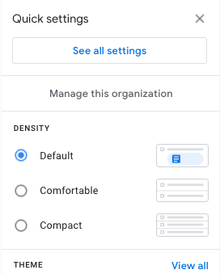
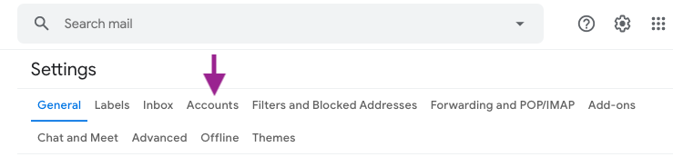
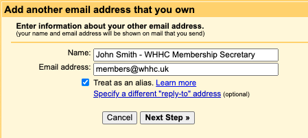
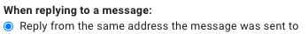

# WHHC email

## Set up for Gmail

### Before you start

You will need:

- a WHHC email forwarded to a gmail account
- a mailgun username and password

### Steps

1. Log into gmail on a desktop.
    
2. Click settings on the top navigation to the right of the search box.
    
    

3. Click the `See all settings` button.

    

4. Click the `Accounts` tab at the top.

    

5. In the `Send mail as` section click `Add another email address`.
6. In the yellow pop-up enter the name and WHHC email address.
7. Ensure the `Treat as an alias.` checkbox is selected
8. Click `Next Step >`.
9. Complete the form with the following detauls and click `Add Account >`.

    > SMTP Server: smtp.mailgun.org 
    > Port: 587 
    > Connection: TLS 
    > Username and Password: your mailgun credentials.
    
     
    
    

    
10. Click `Send Verification`.
11. Make a cup of tea (optional).
12. You should get an email from google with a verification code. Enter this into the pop up on opened on the last step

    > You can reopen this window by clicking verify from the page opened in step 4. 

13. Finally select `Reply from the same address the message was sent to` from the account settings page.

    

### Sending a new email

In the from field when you compose an email there should be a dropdown with your primary email as well as your whhc email(s).